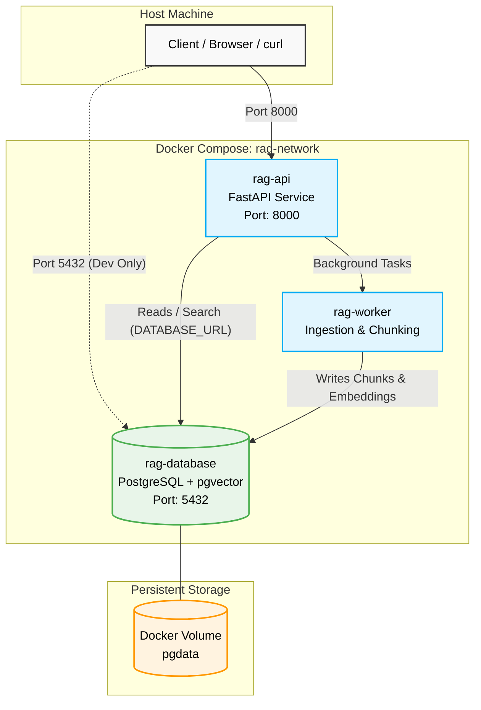

# Docker Container Architecture & Connectivity

This document illustrates exactly how the Docker containers in this project communicate, how the internal network is structured, and how data persists.

## The Container Network

The application is powered by `docker-compose.yml`, which spins up three distinct containers. They all communicate securely over an internal Docker bridge network called `rag-network`.

## How the Implementation Works

### 1. `rag-database` (PostgreSQL + pgvector)

* **Image**: Uses the standard `ankane/pgvector` image.
* **Network Role**: It is the central source of truth. It does not reach out to the internet. It actively listens on port `5432` inside the `rag-network`.
* **Persistence**: The `/var/lib/postgresql/data` directory inside the container is mapped to a Docker named volume called `pgdata` on your host machine. *This means if you destroy the container, your embeddings and documents are not lost!*

### 2. `rag-api` (Reasoning API)

* **Build**: Built locally from `docker/Dockerfile.api`.
* **Connectivity**:
  * It exposes port `8000` to your host machine so you can interact with it via `http://localhost:8000`.
  * It connects to the database using the internal Docker DNS. Instead of targeting `localhost:5432`, it specifically looks for `postgres-pgvector:5432` (the service name defined in `docker-compose.yml`).

### 3. `rag-worker` (Ingestion Engine)

* **Build**: Built locally from `docker/Dockerfile.ingestion`.
* **Connectivity**:
  * It shares the exact same `src/` codebase as the API container.
  * *Crucially*, it exposes **no ports** to the host machine. It runs entirely in the background, out of reach of direct web traffic, making it highly secure.
  * Like the API, it connects to the database via the internal `postgres-pgvector:5432` DNS name to write parsed document vectors.

## Network Security Boundary

Because of the `rag-network` bridge:

1. The API and Worker can talk to the Database.
2. The Database cannot initiate connections to the API/Worker.
3. The host machine (your laptop) can talk to the API on Port 8000, but malicious external traffic cannot directly hit the background worker.

## Environment Variable Injection

When you run `docker-compose up`, Docker reads your local `.env` file (containing your `OPENAI_API_KEY`) and securely injects those strings directly into the running memory of the `rag-api` and `rag-worker` containers. This ensures your keys are never baked permanently into the Docker images themselves.
