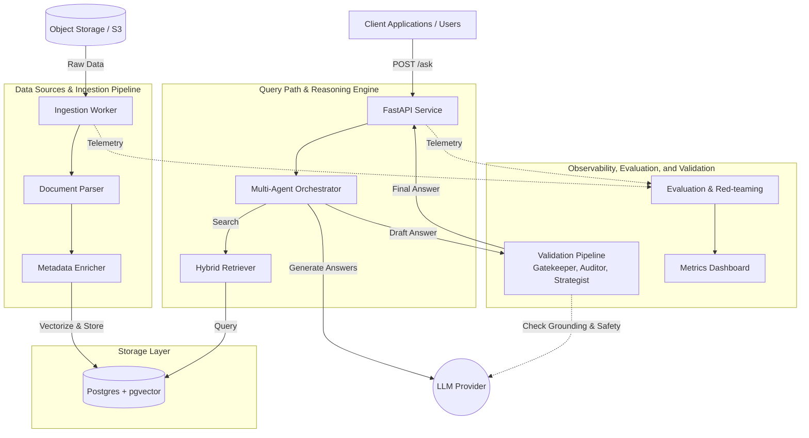
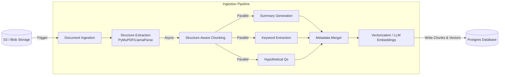
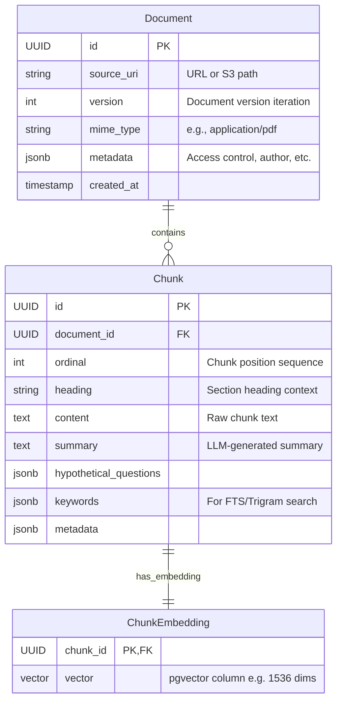
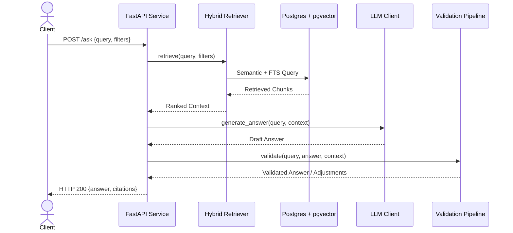
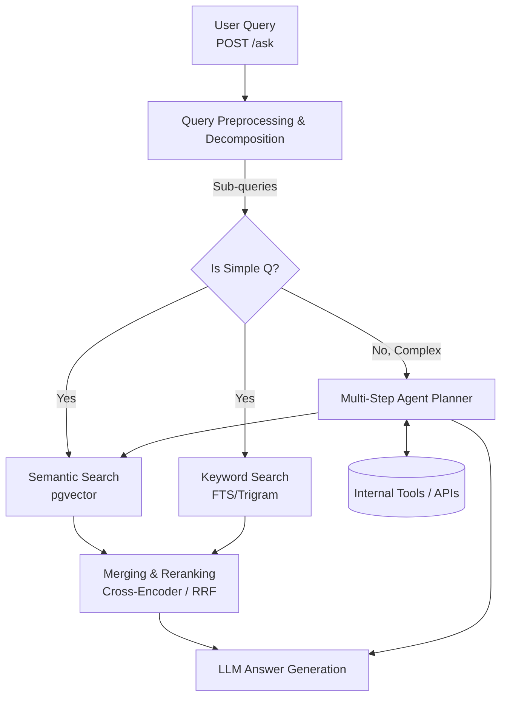
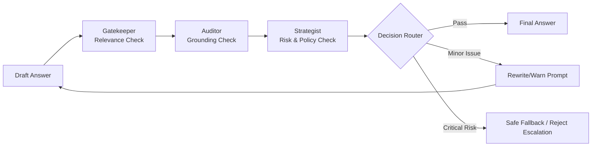
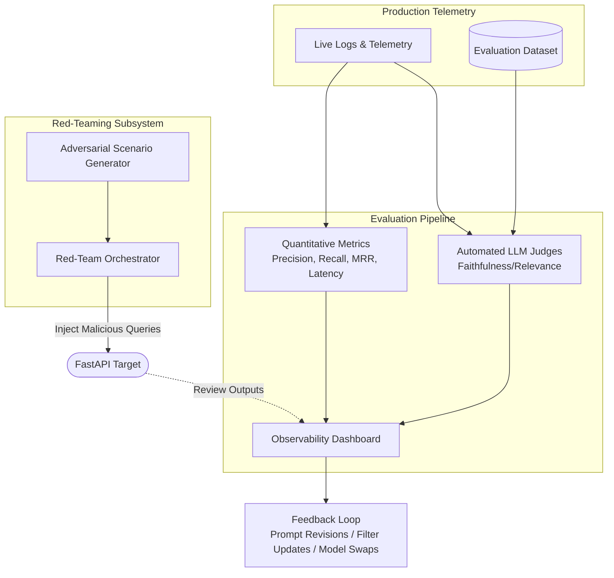

# RAG Platform Architectural Specification

This document provides a comprehensive architectural specification for the production-grade Retrieval-Augmented Generation (RAG) platform. It details the data flows, entity relationships, and failure-mode boundaries across the entire stack, designed for implementation by mid-to-senior backend engineers, ML engineers, and technical leads.

---

## 1. High-level end-to-end architecture

The RAG platform consists of three primary regions. First, the **Data Sources & Ingestion Pipeline** handles acquiring data from various sources (documents, code, databases, S3), parsing it, chunking it, enriching it, and storing the embeddings in Postgres via pgvector. Second, the **Query Path & Reasoning Engine** serves client applications, taking queries through a FastAPI layer, retrieving relevant context via semantic and keyword search, and orchestrating multi-agent reasoning to formulate an answer using an LLM provider. Finally, the **Observability, Evaluation, and Validation Layer** acts as a safeguard and monitoring plane. It validates answers (via Gatekeeper, Auditor, Strategist), tracks metrics, and provides tools for red-teaming the system to ensure safety, relevance, and performance.

*Caption: Top-level component diagram showing the interaction between external clients, ingestion workflows, query/reasoning paths, and the validation/evaluation mechanisms, all backed by Postgres+pgvector and an external LLM provider.*

---

## 2. Ingestion and enrichment pipeline

The ingestion pipeline is designed to be asynchronous and highly parallelizable. It begins with document acquisition and unstructured data extraction (using tools like PyMuPDF or LlamaParse). It applies strict structure-aware chunking to preserve logical boundaries (e.g., paragraphs, tables, code blocks). The chunks then flow into the enrichment phase where LLMs generate summaries, extract keywords, and propose hypothetical questions that this chunk could answer. Following enrichment, chunks are passed through an embedding model and persisted into Postgres+pgvector, bundled with version control, access-control labels, and the generated metadata.

*Caption: Flowchart detailing the asynchronous and parallelizable data ingestion process, from raw document extraction to metadata enrichment and vectorization.*

---

## 3. Data-model diagram (Postgres + pgvector)

The core entities within our Postgres schema include `Document`, `Chunk`, and `ChunkEmbedding`. A single document maps to multiple structured chunks. Each chunk contains raw content as well as enriched metadata (summaries, keywords, hypothetical queries), and maps 1-to-1 with a `ChunkEmbedding`, which stores the `vector(dim)` generated by the embedding model. This schema naturally handles versioning mapping documents to their iterations, and supports row-level security or simple column filtering for multitenancy/department isolation. Hybrid search is achieved by joining `pgvector` similarity operations on the `ChunkEmbedding` table with trigram or full-text search operators on the `Chunk.content` and `Chunk.keywords` columns.

*Caption: ER diagram outlining the primary Postgres schema. Note the separation of raw document tracking from chunks and their specific pgvector embeddings.*

---

## 4. FastAPI + retrieval API layer

The application layer exposes endpoints such as `POST /ingest` for triggering data processing and `POST /ask` for serving queries, alongside standard `/health` endpoints. Rather than tightly coupling with vector store implementations, the FastAPI routers rely on injected abstractions (`Retriever`, `LLMClient`, `PostgresRepository`). During a `POST /ask` call, the FastAPI service delegates work to an orchestrator which prompts the retriever (accessing Postgres via injected clients), passes the retrieved context to the LLM Client, and then pushes the draft answer through a validation pipeline before returning proper HTTP responses to the client.

*Caption: Sequence diagram of the core /ask endpoint, illustrating dependency injection flow through retrieval, reasoning, and validation without tight coupling.*

---

## 5. Hybrid retrieval and reasoning engine

The reasoning layer handles exactly how user queries are translated into database lookups and actions. First, queries undergo preprocessing (expansion or decomposition). The engine performs Hybrid Search by executing semantic search (via `pgvector`) in parallel with keyword search (via Postgres Full-Text Search). The candidate datasets are merged and pushed through a cross-encoder or reciprocal rank fusion (RRF) reranker. For complex queries, a multi-step planner (built on LangGraph or a similar agent framework) can execute tool calling, loop through intermediate reasoning steps, and aggregate context until an answer is fully materialized.

*Caption: Architecture of the hybrid reasoning engine, highlighting the parallel semantic/keyword retrieval, reranking, and the branch for multi-agent orchestration for complicated requests.*

---

## 6. Validation, safety, and quality layer

Prior to returning an answer to the client, the response passes through a pipeline of guardrails consisting of three main actors. The **Gatekeeper** checks if the answer conceptually aligns with and addresses the user's initial question. The **Auditor** fact-checks the answer to guarantee it is genuinely grounded within the retrieved context chunks (minimizing hallucinations). The **Strategist** evaluates coherence with business logic, brand tone, and risk compliance. A conditional router aggregates these reports; if the answer fails critical checks, the router can trigger a rewrite, append warnings, or entirely short-circuit and reject the response with a safe fallback escalation.

*Caption: Flowchart of the validation pipeline demonstrating the Gatekeeper-Auditor-Strategist triad and the conditional safety routing acting on draft answers.*

---

## 7. Evaluation, monitoring, and red-teaming

The RAG system is continuously evaluated using a combination of qualitative judges and quantitative telemetry. An automated LLM-as-a-judge mechanism grades responses on faithfulness, depth, and relevance against an evaluation dataset. We also track quantitative metrics like Mean Reciprocal Rank (MRR), chunk retrieval precision, overall latency, and computational costs. Crucially, a parallel Red-Teaming subsystem orchestrates automated adversarial queries (testing for prompt injection, data leakage, and bias). This continuous probing guides immediate prompt or filter updates, and informs longer-term foundation model swaps.

*Caption: Component graph detailing the separation of continuous evaluation telemetry, quantitative tracking, and automated red-teaming pipelines that feed back into system hardening.*
